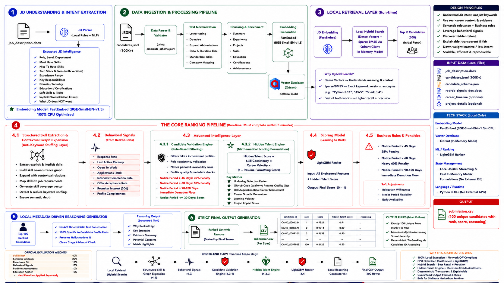
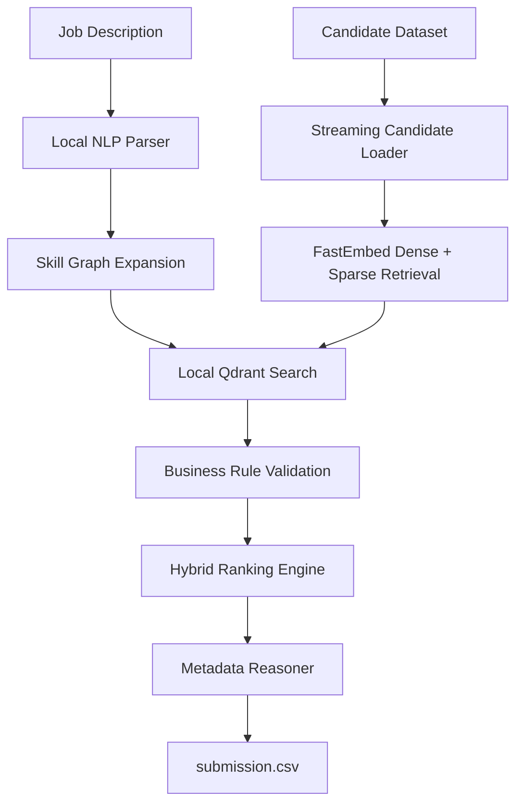

# 🎯 RankForge AI

## Intelligent Candidate Discovery & Ranking Engine

### Redrob AI Hackathon Submission


---

## 📖 Project Overview

RankForge AI is a fully offline, deterministic Candidate Discovery & Ranking Engine developed for the **Redrob AI Hackathon**.

The system is designed to identify high-quality AI engineering candidates by combining semantic retrieval, structured metadata, behavioral signals, and deterministic business rules instead of relying solely on keyword matching.

Starting from a Job Description and a large candidate dataset, the pipeline retrieves relevant profiles, validates candidate eligibility through multiple rule-based filters, computes a hybrid ranking score, generates metadata-driven explanations, and exports the final Top-100 ranked candidates as `submission.csv`.

The complete inference pipeline executes locally on CPU without requiring external APIs or cloud services, ensuring reproducibility and deterministic output.

Explore the deployed Streamlit dashboard:

**🌐 Live Streamlit Dashboard:**  
https://adiityaraj-redrob-ai-candidate-discovery-appdashboard-tjrltp.streamlit.app/

---
---

# ✨ Key Features

### 🔍 Semantic Candidate Discovery

- Local Job Description parsing
- Skill graph expansion
- Dense + Sparse semantic retrieval
- Hybrid candidate matching

---

### ⚙️ Deterministic Validation Engine

Candidates are validated before scoring using structured business rules including:

- Title validation
- Experience validation
- Domain validation
- Behavioral validation
- Platform signal validation
- Notice period evaluation

Only validated candidates proceed to ranking.

---

### 📊 Hybrid Ranking Engine

The final ranking score combines multiple candidate signals including:

- Skill relevance
- Semantic similarity
- Experience fit
- Behavioral signals
- Platform metadata
- Business-rule multipliers

Final scores are normalized to a continuous range between:

```text
0.0000 → 1.0000
```

---

### 💡 Explainable Ranking

Every ranked candidate includes a deterministic explanation generated directly from verified profile metadata.

The explanation engine is metadata-driven and does not rely on generative AI during inference, ensuring:

- Deterministic output
- Reproducibility
- Fact-grounded reasoning
- Zero hallucinated explanations

---

# 🏗️ System Architecture

The complete pipeline is organized into four deterministic execution layers:

| Layer | Responsibility |
|--------|----------------|
| **Offline Ingestion** | Parse Job Description, stream candidate dataset, and prepare semantic representations. |
| **Candidate Validation** | Apply deterministic business rules to eliminate ineligible profiles before scoring. |
| **Hybrid Scoring Engine** | Compute the final ranking score using weighted candidate signals and business multipliers. |
| **Explainability & Export** | Generate metadata-driven explanations and export the final `submission.csv`. |

---

## 📌 Architecture Diagram

<p align="center">

</p>

---

## 📈 Pipeline Flow



The diagram above illustrates the high-level execution flow. A detailed architecture diagram is provided in **docs/architecture.png**.

---
# 📂 Repository Structure

```text
RankForge-AI/
│
├── app/                         # Streamlit dashboard
├── data/
│   ├── raw/                     # Input files (JD & Candidates)
│   └── processed/               # Local vector storage
│
├── docs/                        # Architecture diagrams
│
├── src/
│   ├── stage1_parser/
│   ├── stage2_embedding/
│   ├── stage3_retrieval/
│   ├── stage4_reranking/
│   ├── stage5_explanation/
│   ├── utils/
│   └── config.py
│
├── tests/
│   ├── run_pipeline.sh
│   ├── run_pipeline.bat
│   └── README.md
│
├── Dockerfile
├── main_cli.py
├── validate_submission.py
├── requirements.txt
├── submission_metadata.yaml
├── submission.csv
└── README.md
```

---

# ⚙️ Requirements

Before running the project, ensure the following environment is available:

| Requirement | Version |
|-------------|---------|
| Python | 3.10+ |
| Operating System | Windows / Linux / macOS |
| CPU | Any modern x64 processor |
| Docker *(Optional)* | Latest Version |

> **Note:** Internet access is required only during the first execution if the embedding models need to be downloaded and cached locally. After caching, the ranking pipeline runs completely offline.

---

# 🔧 Installation

### 1. Clone the Repository

```bash
git clone https://github.com/AdiityaRaj/redrob-ai-candidate-discovery.git
cd RankForge-AI
```

---

### 2. Create Virtual Environment

**Windows**

```bash
python -m venv .venv
.venv\Scripts\activate
```

**Linux / macOS**

```bash
python3 -m venv .venv
source .venv/bin/activate
```

---

### 3. Install Dependencies

```bash
pip install --upgrade pip
pip install -r requirements.txt
```

---

# 🚀 Quick Start

Place the required input files inside:

```text
data/
└── raw/
      ├── job_description.docx
      └── candidates.jsonl
```

Run the complete pipeline:

```bash
python main_cli.py
```

The pipeline automatically performs:

- Job Description Parsing
- Candidate Dataset Streaming
- Semantic Retrieval
- Candidate Validation
- Hybrid Scoring
- Metadata-Based Explainability
- Top-100 CSV Export
---
## 🌐 Run the Streamlit Dashboard

To launch the interactive dashboard locally, execute:

```bash
streamlit run app/dashboard.py
```

After the server starts, open your browser and navigate to:

```text
http://localhost:8501
```

The dashboard provides an interactive interface to:

- Upload a sample data (`.json/jsonl`)
- Execute the offline ranking pipeline
- View ranked candidates and explanations
- Export the generated `submission.csv`

---
---

# ⭐ Single Reproduction Command

This repository satisfies the Redrob AI Hackathon reproducibility requirement.

From the repository root, execute:

```bash
python main_cli.py
```

Or specify custom input/output locations:

```bash
python main_cli.py \
    --jd data/raw/job_description.docx \
    --candidates data/raw/candidates.jsonl \
    --out submission.csv
```

After execution, the generated output will be available at:

```text
submission.csv
```

---

# 🐳 Docker Reproduction

Build the Docker image:

```bash
docker build -t rankforge-ai .
```

Run the complete offline pipeline:

```bash
docker run --rm --network none rankforge-ai
```

The Docker container automatically:

- Executes the ranking pipeline
- Generates `submission.csv`
- Runs the validation script
- Exits successfully if all validation checks pass

---

# ✅ Reproducibility

For convenience, platform-specific helper scripts are also provided.

**Linux / macOS**

```bash
bash tests/run_pipeline.sh
```

**Windows**

```cmd
tests\run_pipeline.bat
```

Both scripts:

- Execute the complete ranking pipeline
- Generate `submission.csv`
- Validate the generated output
- Return a non-zero exit code if validation fails

This ensures identical execution across supported operating systems.

# 🔄 Pipeline Stages

The complete ranking workflow consists of five deterministic execution stages.

| Stage | Description |
|--------|-------------|
| **Stage 1 — Job Understanding** | Parse the Job Description and extract required skills, experience, and hiring signals. |
| **Stage 2 — Candidate Retrieval** | Generate semantic embeddings and retrieve relevant candidates using FastEmbed and Local Qdrant. |
| **Stage 3 — Candidate Validation** | Apply deterministic business rules to eliminate ineligible candidates before scoring. |
| **Stage 4 — Hybrid Ranking** | Compute the final ranking score using weighted signals and business-rule multipliers. |
| **Stage 5 — Explainability & Export** | Generate metadata-driven explanations and export the final Top-100 candidates to `submission.csv`. |

---

# 📊 Scoring Methodology

The final candidate score is computed using a weighted hybrid scoring framework.

| Component | Weight |
|-----------|-------:|
| Skill Match | **40%** |
| Semantic Similarity | **20%** |
| Experience Fit | **15%** |
| Behavioral Signals | **10%** |
| Platform Signals | **10%** |
| Education | **5%** |

After the baseline score is calculated, additional deterministic business rules are applied, including:

- Title-based multipliers
- Information Retrieval expertise boost
- Vector database expertise boost
- Evaluation framework boost
- Notice period adjustment
- Business-rule penalties

Finally, all scores are normalized into a continuous range of:

```text
0.0000 → 1.0000
```

before deterministic ranking.

---

# 📄 Output Format

Executing the pipeline generates:

```text
submission.csv
```

The exported file contains the following columns:

| Column | Description |
|---------|-------------|
| `candidate_id` | Unique candidate identifier |
| `rank` | Final ranking position |
| `score` | Normalized ranking score |
| `reasoning` | Metadata-driven explanation |

Candidates are sorted by:

1. Final Score (Descending)
2. Candidate ID (Ascending tie-breaker)

The final submission always contains **exactly 100 ranked candidates**.

---

# ⚡ Performance Characteristics

The pipeline is designed for efficient offline execution.

- CPU-only inference
- Fully offline execution after model caching
- Deterministic ranking pipeline
- Streaming JSONL candidate processing
- Metadata-driven explainability
- Reproducible results
- Docker-compatible deployment

---

# 🛠️ Technologies Used

| Technology | Purpose |
|------------|---------|
| **Python 3.10+** | Core application |
| **FastEmbed** | Dense & Sparse Embeddings |
| **Qdrant** | Local Vector Search |
| **Streamlit** | Interactive Dashboard |
| **Pandas** | Data Processing |
| **NumPy** | Numerical Operations |
| **python-docx** | Job Description Parsing |
| **Docker** | Reproducible Environment |

---

# 📦 Submission Assets

This repository includes all required submission artifacts.

| Asset | Status |
|--------|--------|
| Source Code | ✅ |
| README Documentation | ✅ |
| Architecture Diagram | ✅ |
| Dockerfile | ✅ |
| requirements.txt | ✅ |
| submission_metadata.yaml | ✅ |
| Validation Script | ✅ |
| Pipeline Scripts | ✅ |
| Streamlit Dashboard | ✅ |
| submission.csv | ✅ |

---

# 🤝 AI-Assisted Development

AI tools were used during the development process for architecture brainstorming, implementation guidance, debugging, documentation, and code quality improvements.

All final engineering decisions, implementation, testing, validation, and pipeline integration were performed manually. The final ranking pipeline executes fully offline without relying on external AI services or API calls during candidate retrieval, scoring, or inference.

---

# 📜 License

This repository was developed as a submission for the **Redrob AI Candidate Discovery & Ranking Hackathon**.

It is intended for evaluation and educational purposes.

---

<div align="center">

### ⭐ Thank you for reviewing our submission.

**Redrob AI Hackathon 2026**

</div>
